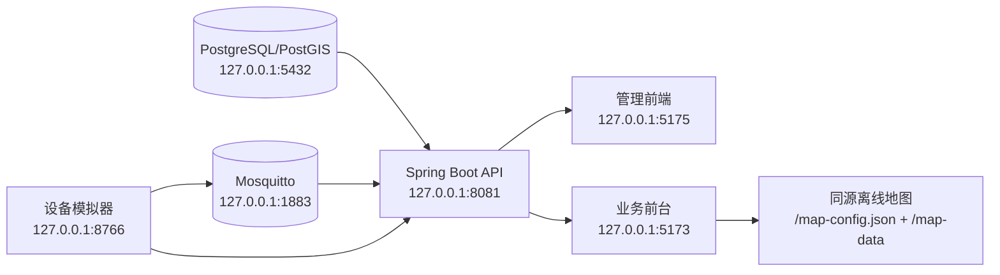

# 系统启动拓扑与故障定位

本项目的本地闭环按以下顺序启动：数据库与可选 MQTT → Spring Boot API → 业务前台（提供地图同源资源）→ 管理前端 → 可选设备模拟器。验收运行明确保持 `app.dev-seed.enabled=false`；设备数据只能来自界面录入、实际接入或模拟器通过接口/MQTT 上报。



| 服务 | 地址 | 启动入口 | 健康判据 | 依赖 |
| --- | --- | --- | --- | --- |
| PostgreSQL/PostGIS | Compose 默认 `127.0.0.1:5432`；当前运行态 `127.0.0.1:25432` | `docker compose -f deploy/compose.yml up -d --wait db` | Compose `healthy` | Docker Desktop |
| Mosquitto（可选） | `127.0.0.1:1883` | `docker compose -f deploy/compose.yml --profile qa up -d --wait mosquitto` | Compose `running` | Docker Desktop |
| 后端 API | `http://127.0.0.1:8081` | `server/mvnw.cmd spring-boot:run -Dspring-boot.run.profiles=local` | `GET /actuator/health` 返回 2xx | PostgreSQL；需要 MQTT 时再依赖 Mosquitto |
| 业务前台 | `http://127.0.0.1:5173` | 前台仓库 `demo-ronghe` 的 `dongying-vue/` 下 `npm run dev`（旧机器上的同级 `rwurenji/_rong` 仍兼容） | 首页 2xx；`/map-config.json` 为 JSON | API；地图目录 |
| 管理前端 | `http://127.0.0.1:5175` | `ruoyi-ui/npm run dev` | 首页 2xx；`/dev-api/v1/auth/me` 代理可用 | API；地图时还依赖业务前台 |
| 设备模拟器（可选） | `http://127.0.0.1:8766` | 前台仓库 `demo-ronghe` 的 `tools/device-simulator/server.py --port 8766`；通知回执程序 `realtime_notification_receiver.py` 在同一目录 | 首页 2xx；登录后读取 API/MQTT 状态 | API、MQTT、业务前台地图 |

推荐使用一键入口：

```powershell
cd E:\houtaiguanlii
.\scripts\start-local.ps1 -WithMqtt -WithSimulator
.\scripts\smoke-system.ps1 -RequireBusinessFrontend -RequireSimulator
```

可直接双击仓库根目录的 `一键启动.cmd`，随后双击 `一键关闭.cmd` 关闭整套本地服务。脚本把后端、两个前端和模拟器放到隐藏子进程中，日志和进程清单写入仓库忽略目录 `artifacts/local-runtime`，数据库密码不写入启动文件或进程清单。既有数据库容器从停止状态恢复时沿用原端口与数据卷。

关闭入口先请求模拟器停止收发，再核对进程身份并停止完整进程树，最后停止记录的数据库/MQTT 容器；不删除数据、容器或历史，也不关闭其他项目或 Docker Desktop。复用的非托管服务保持运行；存在这类服务时整套关闭会提示并保留数据库/MQTT。仅关闭本脚本启动的应用、保留数据库/MQTT 使用：

```powershell
.\scripts\stop-local.ps1
```

完整关闭的命令行入口为 `.\scripts\stop-one-click.ps1`。重复启动保留原有进程记录；PID 创建时间或启动命令不匹配时不会按旧 PID 杀进程。所有启动文件均兼容 Windows PowerShell 5.1。Vite 与设备模拟器只监听本机，Vite 端口被占用时失败，不会静默换端口；后端沿用自身监听配置。

## 最小冒烟链路

1. Compose 报告数据库健康；需要实时接入时，Mosquitto 端口 1883 可连接。
2. `/actuator/health` 返回 2xx，管理前台和业务前台首页返回 2xx。
3. `POST /api/v1/auth/login` 返回 `session_id`；同一 Bearer 会话访问后端 `/auth/me`、管理端 `/dev-api/v1/auth/me` 和业务前台 `/api/v1/auth/me`。
4. 登录后读取 `/api/v1/devices?page=1&size=1`，响应保持 `{ok,data,error}`、`data.items/page/size/total`，设备项使用字符串 `device_id`、`device_no` 与统一的 `connectivity`。
5. 业务前台与管理前台都能读取 `/map-config.json`；地图包资源从同源 `/map-data` 提供，不能改为浏览器直接访问第三方瓦片或模拟器目录。
6. 启动模拟器后，通过现有 `/devices/onboard` 和 MQTT 接入产生设备注册、心跳和一条观测；页面回读必须以 API/数据库事实为准。模拟器为同一逻辑设备复用稳定 `device_no`/`external_device_id`，重启后需重新登录并重新启动场景；旧批次保持停止，不自动续发。

## 故障定位表

| 现象 | 先查 | 结论边界 |
| --- | --- | --- |
| API health 失败 | `api.err.log`、数据库 Compose health、`DB_URL` | API 未就绪时不要查前端页面；迁移错误先修数据库/配置 |
| 登录失败但 health 正常 | `admin1` 临时密码、`app.bootstrap-admin.enabled`、`app.dev-seed.enabled=false` | 演示种子关闭时不能期待 Seeder 账号；空库依赖 bootstrap-admin |
| 管理端能开但接口 401/断开 | `/dev-api` 代理、Bearer 是否沿用、API 是否重启 | 页面不能直接读数据库或模拟器；先检查代理再查业务接口 |
| 管理端地图空白 | 5173 首页、`5173/map-config.json`、`5175/map-config.json`、地图目录 | 地图资源走业务前台同源代理；地图失败不等于设备 API 失败 |
| 设备列表为空 | 是否真的完成 onboard、`source_mode`、权限范围、数据库查询 | `dev-seed=false` 时空列表可能是正确结果；不能用空列表伪造在线设备 |
| 设备显示在线后马上离线 | `last_heartbeat_at`、后端心跳超时、MQTT session、模拟器发布日志 | 在线只由有效心跳与后端状态决定；发送过一条数据不能代替心跳 |
| 模拟器重启后数据不再来 | 模拟器登录状态、MQTT broker、稳定 `device_no`/`external_device_id`、重启后的批次状态 | 重新登录并启动场景会先按稳定身份回读绑定；旧批次保持 STOPPED，不自动续发；单条 PUBACK 结果未知时必须先回读再决定是否重试 |

## 统一设备状态契约

后端设备状态只认以下字段：`device_id`（平台字符串 ID）、`device_no`（展示/接入编号）、`connectivity`（`ONLINE|OFFLINE|ABNORMAL|UNKNOWN`）、`health_code`（健康结论）、`last_heartbeat_at`（心跳时间）、`observed_at`（设备上报时间）、`received_at`（平台接收时间）、`unknown_reason`（不可判定原因）、`simulated`（来源标记）。前端只消费 API 返回的 snake_case 字段；模拟器不得直接写 `ops_device_state`，必须走 onboard、协议上报和平台超时判定。
